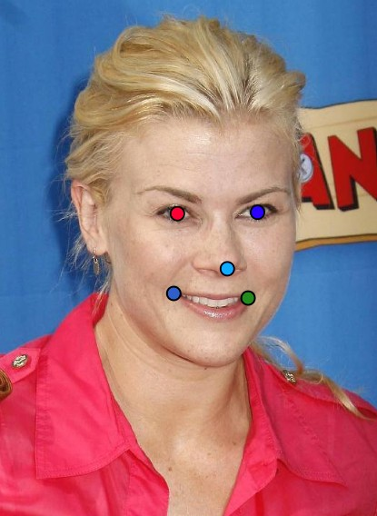

# face-detection-with-5-point-landmarks

## Data Collection

- iBug
- AFW
- LFPW
- Helen: some sample to test

| dataset | images |
| :---: | :---: |
| Training Set | 1090 |
| Validation Set | 224 |
| Test Set | 16 |



## Train

### Download weight

download [YOLO26n.pt](https://github.com/ultralytics/assets/releases/download/v8.4.0/yolo26n.pt)


### dataset directory structure

```text
top-down-head/
├── data.yaml
├── images/
│   ├── train/
│   └── val/
└── labels/
    ├── train/
    └── val/
```

📊 Model Performance
Framework: Ultralytics YOLO (Pose-based)
mAP50(P): 0.99161 (99.2%)

📂 Dataset
Source: iBug + AFW + LFPW
Training Set: 1090 images
Validation Set: 224 images

💻 Inference & Testing
Test Dataset: ChokePoint Dataset
Hardware: NVIDIA Tesla T4 (Kaggle)
Environment: Kaggle Notebook

